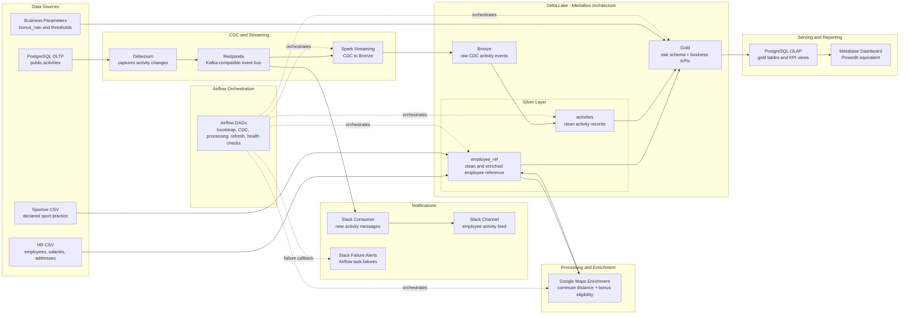
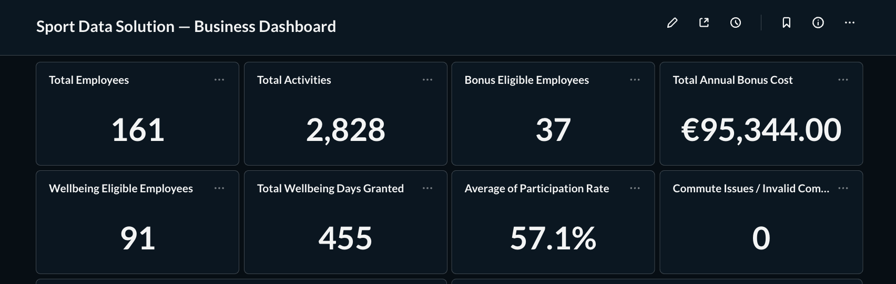
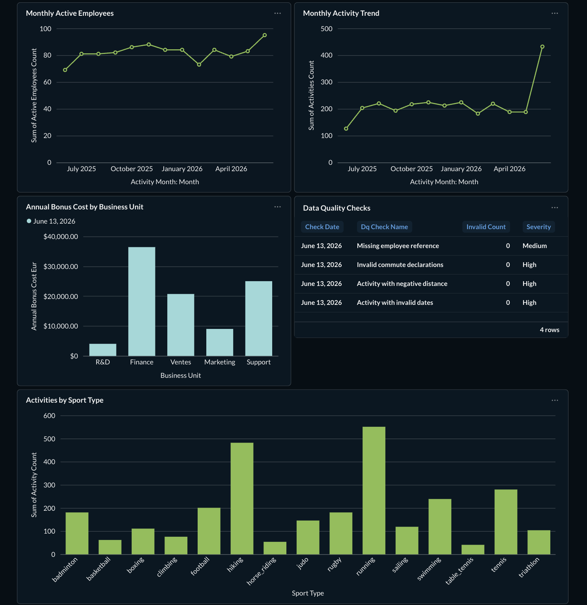
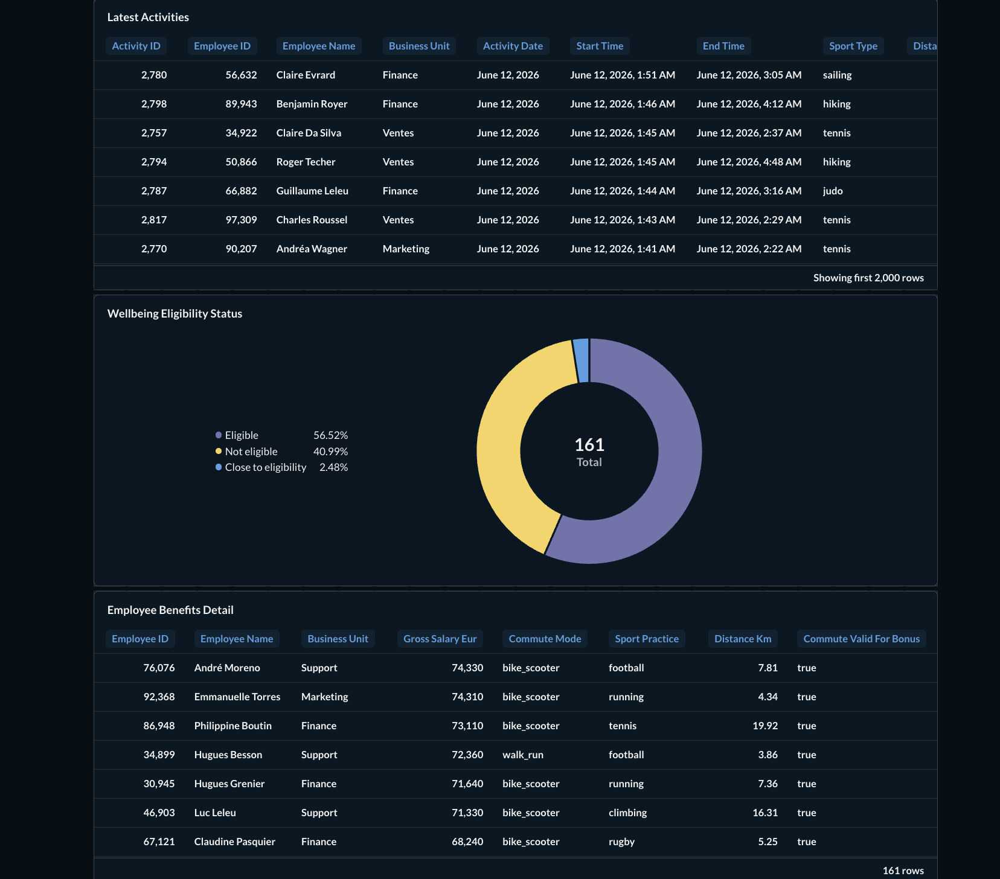
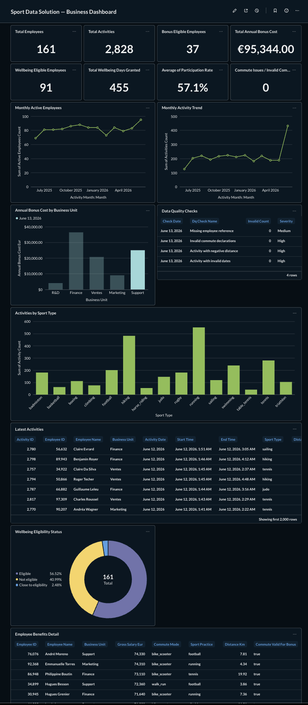

# Project 12 : Gérez un projet d'infrastructure
## Sport Data Solution — Option B

## Automated Data Architecture POC with Airflow, Spark, Redpanda, Debezium, Delta Lake and Metabase

---

## 1. Project Context

This project was developed as part of the OpenClassrooms Data Engineer path, Option B: **“Créez et automatisez une architecture de données”**.

Sport Data Solution is a fictional start-up focused on sport monitoring and performance analysis for amateur and semi-professional athletes. The company wants to encourage employees to practise sport regularly by offering internal benefits.

The objective of this POC is to build an end-to-end data architecture able to:

* ingest HR, sportive and activity data;
* process data through automated pipelines;
* calculate business indicators;
* estimate the financial impact of sport-related benefits;
* publish new activities to Slack;
* expose final KPIs through a BI dashboard;
* monitor data quality and service health;
* support recalculation if a source or business parameter changes.

---

## 2. Business Objectives

The company wants to evaluate two possible employee benefits.

### 2.1 Sport commute bonus

Employees who come to the office using a sport-related transport mode, such as walking, running, cycling or scooter, may receive a bonus equal to a percentage of their annual gross salary.

The default bonus rate used in the POC is:

```text
bonus_rate = 5%
```

This parameter is stored in the reporting layer and can be changed to recalculate the financial impact.

### 2.2 Wellbeing days

Employees who practise sport regularly outside work may be eligible for additional wellbeing days.

The dashboard helps the business understand:

* how many employees are eligible;
* the estimated financial cost of the benefits;
* activity volume over time;
* distribution by sport type and business unit;
* data quality status;
* impact of changing the bonus percentage.

---

## 3. Architecture Overview

This project implements a containerized data architecture using Docker Compose.

The architecture separates two main source categories.

### 3.1 Reference sources

HR and sportive datasets are treated as slowly changing reference data in the POC. They contain employee information, salary, address, commute mode and declared sport practice.

### 3.2 Event source

The PostgreSQL `public.activities` table represents employee sport activity events.

In the POC, activity events are simulated. In production, they could come from an external provider such as Strava, Garmin, or an internal sport-tracking application.

The pipeline follows a Medallion Architecture:

* **Bronze**: raw CDC activity events.
* **Silver**: cleaned and standardized business tables.
* **Gold**: trusted star-schema tables and OLAP-ready outputs for reporting.

Apache Airflow orchestrates the pipelines. Spark performs data processing. Redpanda provides Kafka-compatible streaming. Debezium captures PostgreSQL changes. Delta Lake stores analytical layers. PostgreSQL serves the OLTP source and OLAP reporting layer. Google Maps enriches commute distances for bonus eligibility. Metabase is used as a PowerBI-equivalent dashboarding tool.



---

## 4. Technology Stack

| Component        | Tool                             | Role                                               |
| ---------------- | -------------------------------- | -------------------------------------------------- |
| Orchestration    | Apache Airflow                   | DAG scheduling, pipeline orchestration, monitoring |
| Processing       | Apache Spark / PySpark           | Batch and streaming transformations                |
| Streaming        | Redpanda                         | Kafka-compatible event bus                         |
| CDC              | Debezium                         | Captures changes from PostgreSQL activities table  |
| Storage          | Delta Lake                       | Bronze, Silver and Gold analytical layers          |
| OLTP source      | PostgreSQL                       | Operational activity source                        |
| OLAP reporting   | PostgreSQL                       | Reporting tables and KPI views                     |
| Dashboard        | Metabase                         | PowerBI-equivalent reporting tool                  |
| Enrichment       | Google Maps Distance Matrix      | Commute distance calculation                       |
| Notification     | Slack                            | Activity notifications and Airflow failure alerts  |
| Data Quality     | Great Expectations + Spark rules | Validation of Silver tables                        |
| Containerization | Docker Compose                   | Local reproducible POC environment                 |

---

## 5. Project Directory Structure

```text
P12-sport-data-solution-option-b/
│
├── README.md
├── docker-compose.yml
├── .env.example
├── .gitignore
├── requirements.txt
│
├── airflow/
│   └── dags/
│       ├── 00_system_check.py
│       ├── 01_bootstrap.py
│       ├── 02_cdc_streaming.py
│       ├── 03_bronze_silver_gold.py
│       ├── 04_daily_full.py
│       ├── 05_demo_full_pipeline_quick.py
│       ├── 06_services_health_check.py
│       ├── 07_refresh_sources_and_kpis.py
│       │
│       └── alerts/
│           ├── __init__.py
│           └── slack_alerts.py
│
├── config/
│   └── spark-defaults.conf
│
├── connectors/
│   └── pg-activities.json
│
├── data/
│   ├── raw/
│   │   ├── hr.csv
│   │   └── sportive.csv
│   │
│   └── delta/                  # generated locally, not committed
│       ├── bronze/
│       ├── silver/
│       └── gold/
│
├── docker/
│   ├── airflow/
│   │   └── Dockerfile
│   │
│   ├── spark/
│   │   └── Dockerfile
│   │
│   └── slack-consumer/
│       ├── Dockerfile
│       └── slack_consumer.py
│
├── scripts/
│   ├── create_olap_role_and_database.sh
│   ├── generate_activities.py
│   ├── generate_daily_activities.py
│   ├── hr_sportive_to_silver_employee_ref.py
│   ├── enrich_commute_gmaps.py
│   ├── cdc_to_bronze_stream.py
│   ├── bronze_to_silver.py
│   ├── check_employee_ref_dq.py
│   ├── check_activities_dq.py
│   └── silver_to_gold_delta_and_olap.py
│
├── sql/
│   ├── 01_create_oltp_activities_table.sql
│   ├── 02_create_gold_schema_tables_params_and_views.sql
│   └── demo_activity_source_change.sql
│
└── docs/
│   └── screenshots/
│       ├── metabase_dashboard_full.png
│       ├── metabase_dashboard_kpis.png
│       ├── metabase_dashboard_activity_finance.png
│       └── metabase_dashboard_quality_benefits.png
```

### Notes about generated folders

The following folders and files are generated locally and should not be committed:

```text
airflow/logs/
logs/
data/delta/
__pycache__/
.pytest_cache/
.DS_Store
__MACOSX/
```

The `data/delta/` directory contains local Delta Lake outputs created by Spark:

```text
data/delta/bronze/
data/delta/silver/
data/delta/gold/
```

These are runtime outputs, not source code.

---

## 6. Docker Compose and Containerized Services

The project is fully containerized with Docker Compose.

The Compose file defines the local runtime environment for:

* PostgreSQL;
* Redpanda;
* Debezium Connect;
* Spark master and worker;
* Airflow webserver and scheduler;
* Metabase;
* Slack consumer.

All services run on a shared Docker network.

---

### 6.1 Services overview

| Service             | Image                        | Role                                                              | Main exposed port      |
| ------------------- | ---------------------------- | ----------------------------------------------------------------- | ---------------------- |
| `postgres`          | `postgres:15-alpine`         | Hosts the OLTP database and supports Debezium logical replication | `5432`                 |
| `redpanda`          | `redpandadata/redpanda`      | Kafka-compatible event bus                                        | `9092`, `8082`, `9644` |
| `redpanda-console`  | `redpandadata/console`       | Web UI for Redpanda topics and Connect                            | `8080`                 |
| `connect`           | Debezium Connect image       | Runs the PostgreSQL Debezium connector                            | `8083`                 |
| `spark-master`      | `sport-spark:local`          | Spark master and `spark-submit` target                            | `7077`, `8081`         |
| `spark-worker`      | `sport-spark:local`          | Spark worker node                                                 | internal               |
| `metabase`          | `metabase/metabase`          | BI dashboard tool                                                 | `3000`                 |
| `airflow-postgres`  | `postgres:15-alpine`         | Airflow metadata database                                         | internal               |
| `airflow-init`      | `sport-airflow:local`        | Initializes Airflow metadata and admin user                       | one-shot               |
| `airflow-webserver` | `sport-airflow:local`        | Airflow UI                                                        | `8088`                 |
| `airflow-scheduler` | `sport-airflow:local`        | Schedules and launches DAG tasks                                  | internal               |
| `slack-consumer`    | `sport-slack-consumer:local` | Sends new activity events to Slack                                | internal               |

The main PostgreSQL service is configured for logical replication, which is required by Debezium to capture changes from `public.activities`.

---

### 6.2 Custom Docker images

The project builds three local images.

#### `sport-airflow:local`

Built from:

```text
docker/airflow/Dockerfile
```

Purpose:

* runs the Airflow webserver, scheduler and init container;
* installs project Python dependencies;
* allows Airflow tasks to orchestrate other services using Docker commands.

Used by:

```text
airflow-init
airflow-webserver
airflow-scheduler
```

---

#### `sport-spark:local`

Built from:

```text
docker/spark/Dockerfile
```

Purpose:

* runs Spark master and Spark worker;
* installs project Python dependencies;
* executes PySpark scripts from `/opt/workspace/scripts`;
* reads and writes Delta Lake tables from `/opt/workspace/data/delta`.

Used by:

```text
spark-master
spark-worker
```

---

#### `sport-slack-consumer:local`

Built from:

```text
docker/slack-consumer/Dockerfile
```

Purpose:

* runs the Python Slack consumer;
* consumes activity events from Redpanda;
* sends Slack messages through a webhook;
* skips snapshot/read events to avoid posting historical rows.

Used by:

```text
slack-consumer
```

---

### 6.3 Main mounted folders

| Host folder      | Container path              | Used by                             |
| ---------------- | --------------------------- | ----------------------------------- |
| `./airflow/dags` | `/opt/airflow/dags`         | Airflow DAG discovery               |
| `./scripts`      | `/opt/workspace/scripts`    | Spark and utility scripts           |
| `./sql`          | `/opt/workspace/sql`        | SQL bootstrap and demo scripts      |
| `./data`         | `/opt/workspace/data`       | Raw CSV files and Delta Lake tables |
| `./connectors`   | `/opt/workspace/connectors` | Debezium connector configuration    |
| `./config`       | Spark custom config path    | Spark configuration                 |
| `./logs`         | `/opt/workspace/logs`       | Runtime logs                        |

Airflow also mounts the Docker socket so DAG tasks can execute commands such as:

```bash
docker exec spark-master spark-submit ...
```

This design keeps orchestration in Airflow while the Spark jobs run inside the Spark container.

---

### 6.4 Main web interfaces

After starting Docker Compose, the main local interfaces are:

| Tool                      | URL                     |
| ------------------------- | ----------------------- |
| Airflow                   | `http://localhost:8088` |
| Redpanda Console          | `http://localhost:8080` |
| Spark Master UI           | `http://localhost:8081` |
| Metabase                  | `http://localhost:3000` |
| Debezium Connect REST API | `http://localhost:8083` |

---

### 6.5 Why this container design?

This Compose design is useful for the POC because it provides:

* a reproducible local environment;
* separation between orchestration, streaming, processing, storage and dashboarding;
* realistic CDC with Debezium and Redpanda;
* Spark processing close to a real data platform setup;
* local BI dashboarding with Metabase;
* isolated Airflow metadata database;
* persistent volumes for stateful services;
* clear service health checks and dependencies.

For production, the same logical architecture could be deployed with managed services, for example:

* managed PostgreSQL;
* managed Kafka or Redpanda Cloud;
* managed Airflow;
* Spark on Kubernetes, Databricks, EMR, or GCP Dataproc;
* managed BI or enterprise PowerBI;
* managed secret storage and monitoring.

---

## 7. Data Sources

### 7.1 HR CSV

The HR source contains employee reference data such as:

* employee ID;
* name;
* date of birth;
* business unit;
* hire date;
* annual gross salary;
* contract type;
* annual leave days;
* home address;
* commute mode.

This source is used to build the Silver `employee_ref` table.

### 7.2 Sportive CSV

The sportive source contains the declared sport practice for each employee.

It is joined with the HR source to complete the employee reference table.

### 7.3 PostgreSQL OLTP activities table

The `public.activities` table represents employee sport activities.

In the POC, activities can be created by:

* the one-time historical backfill generator;
* the daily activity generator;
* optional SQL insert/update examples used to simulate source changes.

In production, this table could be populated by an API or webhook integration from a sport provider such as Strava, Garmin or an internal mobile application.

### 7.4 Business parameters

Business parameters are stored in the PostgreSQL OLAP schema.

Examples:

```text
bonus_rate
wellbeing_days
wellbeing_min_activities_12m
walk_run_max_km
bike_scooter_other_max_km
```

Changing these parameters allows KPI views and dashboard outputs to reflect new business rules.

---

## 8. PostgreSQL OLTP and OLAP Setup

The project uses PostgreSQL for two different roles:

1. **OLTP database**: operational source for activity events.
2. **OLAP database**: reporting layer consumed by Metabase.

This separation is intentional. The OLTP table represents the operational activity source, while the OLAP schema contains reporting tables and views.

---

### 8.1 OLTP activities table

The OLTP activity source table is created by:

```text
sql/01_create_oltp_activities_table.sql
```

The table is:

```text
public.activities
```

Main columns:

| Column           | Description                       |
| ---------------- | --------------------------------- |
| `activity_id`    | Auto-generated primary key        |
| `employee_id`    | Employee linked to the activity   |
| `start_time`     | Activity start timestamp          |
| `sport_type`     | Sport type                        |
| `distance_m`     | Distance in meters, when relevant |
| `elapsed_time_s` | Activity duration in seconds      |
| `comment`        | Optional activity comment         |

Indexes are created on:

```text
employee_id
start_time
```

These indexes are useful because the pipeline and reporting logic frequently filter or group by employee and activity time.

This table is the PostgreSQL table watched by Debezium CDC.

---

### 8.2 OLAP role and database

The OLAP role and database are created by:

```text
scripts/create_olap_role_and_database.sh
```

The official PostgreSQL Docker image creates the default database and user automatically. However, this project uses a separate OLAP database and user, so they are created during the bootstrap process.

The script:

* validates required environment variables;
* creates the OLAP role if missing;
* updates the OLAP role password if the role already exists;
* creates the OLAP database if missing;
* ensures the OLAP database owner is correct.

This makes the bootstrap process repeatable.

---

### 8.3 Gold OLAP schema, tables, parameters and views

The Gold OLAP schema is created by:

```text
sql/02_create_gold_schema_tables_params_and_views.sql
```

It creates two schemas:

```text
gold
gold_staging
```

#### Final Gold tables

| Table                | Purpose                                               |
| -------------------- | ----------------------------------------------------- |
| `gold.dim_employee`  | Employee dimension                                    |
| `gold.dim_date`      | Date dimension                                        |
| `gold.fact_activity` | Activity fact table                                   |
| `gold.params`        | Business parameters such as bonus rate and thresholds |

#### Staging tables

| Table                              | Purpose                                    |
| ---------------------------------- | ------------------------------------------ |
| `gold_staging.dim_employee_stage`  | Temporary load area for employee dimension |
| `gold_staging.dim_date_stage`      | Temporary load area for date dimension     |
| `gold_staging.fact_activity_stage` | Temporary load area for activity fact      |

The staging tables are truncated and reloaded during Gold publication. Then the final Gold tables are updated with PostgreSQL `UPSERT`.

This provides a safer publication flow:

```text
Spark Gold DataFrames
→ PostgreSQL staging tables
→ staging validation
→ UPSERT into final gold tables
→ Metabase reads final tables/views
```

---

## 9. Debezium CDC Configuration

Debezium is used to capture changes from the PostgreSQL OLTP activity source.

The connector configuration is defined in:

```text
connectors/pg-activities.json
```

The connector watches:

```text
public.activities
```

and publishes activity change events to the Redpanda topic:

```text
sportdb.public.activities
```

### 9.1 Why Debezium?

Debezium is used because activities are event-based data. Every new activity, correction or update event should be captured automatically instead of relying on periodic full table extracts.

This gives the project an event-driven design:

```text
PostgreSQL activity insert/update
→ Debezium captures the database change
→ Redpanda receives the CDC event
→ Spark streaming writes the event to Bronze
```

### 9.2 Main Debezium settings

Important connector settings:

| Setting                                                                | Meaning                                            |
| ---------------------------------------------------------------------- | -------------------------------------------------- |
| `connector.class = io.debezium.connector.postgresql.PostgresConnector` | Uses the PostgreSQL Debezium connector             |
| `plugin.name = pgoutput`                                               | Uses PostgreSQL logical replication                |
| `table.include.list = public.activities`                               | Captures only the activities table                 |
| `snapshot.mode = initial`                                              | Takes an initial snapshot before streaming changes |
| `topic.prefix = sportdb`                                               | Topic prefix used by Debezium                      |
| `slot.name = debezium_activities`                                      | PostgreSQL replication slot                        |
| `tombstones.on.delete = false`                                         | Avoids extra tombstone records                     |
| `decimal.handling.mode = double`                                       | Converts decimals into double values               |
| `time.precision.mode = adaptive_time_microseconds`                     | Preserves microsecond timestamp precision          |

### 9.3 Unwrap transform

The connector uses Debezium’s `ExtractNewRecordState` transform.

This simplifies the message by extracting the row content and adding useful metadata fields such as:

```text
op
ts_ms
```

These fields help downstream processing understand the type and time of the CDC operation.

### 9.4 Topic creation

The connector configuration creates a topic with:

```text
replication.factor = 1
partitions = 1
cleanup.policy = delete
compression.type = lz4
retention.ms = 604800000
```

For a local POC, one partition and one replica are acceptable. In production, replication factor and partition count should be increased for scalability and resilience.

---

## 10. Medallion Architecture

### 10.1 Bronze Layer

The Bronze layer stores raw CDC activity events captured from PostgreSQL.

Flow:

```text
PostgreSQL OLTP activities
→ Debezium
→ Redpanda
→ Spark Structured Streaming
→ Bronze Delta
```

The objective of Bronze is to preserve raw activity change events before business cleaning or transformation.

The Bronze table keeps technical Kafka metadata such as:

| Column            | Description                            |
| ----------------- | -------------------------------------- |
| `kafka_topic`     | Redpanda/Kafka topic name              |
| `kafka_partition` | Kafka partition                        |
| `kafka_offset`    | Kafka offset                           |
| `kafka_timestamp` | Kafka message timestamp                |
| `kafka_key_str`   | Message key as string                  |
| `kafka_value_str` | Raw Debezium message payload as string |

Bronze is append-only. This makes it possible to debug, audit, or rebuild Silver activities later.

---

### 10.2 Silver Layer

The Silver layer contains cleaned, standardized and business-ready Delta tables.

#### 10.2.1 `silver.employee_ref`

This table is built from the HR and sportive source files.

Main columns:

| Column                    | Description                                                   |
| ------------------------- | ------------------------------------------------------------- |
| `employee_id`             | Unique employee identifier                                    |
| `last_name`               | Employee last name                                            |
| `first_name`              | Employee first name                                           |
| `birth_date`              | Parsed employee birth date                                    |
| `business_unit`           | Employee business unit                                        |
| `hire_date`               | Parsed hiring date                                            |
| `gross_salary_eur`        | Annual gross salary converted to numeric format               |
| `contract_type`           | Employee contract type                                        |
| `annual_leave_days`       | Number of annual leave days                                   |
| `home_address`            | Employee home address                                         |
| `commute_mode`            | Standardized commute mode                                     |
| `sport_practice`          | Standardized declared sport practice                          |
| `has_sport_practice`      | Boolean flag indicating whether the employee declared a sport |
| `business_hash`           | Hash used to detect business changes between runs             |
| `created_at`              | First insertion timestamp in the Silver table                 |
| `updated_at`              | Last business update timestamp                                |
| `distance_km`             | Commute distance calculated by Google Maps                    |
| `commute_valid_for_bonus` | Boolean flag indicating whether commute is eligible for bonus |
| `commute_checked_at`      | Timestamp of the last commute enrichment                      |

The `employee_ref` table is updated with an idempotent Delta `MERGE` on `employee_id`. This prevents duplicate employees and updates only rows whose business content changed.

#### 10.2.2 `silver.activities`

This table is built from raw CDC activity events stored in Bronze.

Main columns:

| Column           | Description                                      |
| ---------------- | ------------------------------------------------ |
| `activity_id`    | Unique activity identifier                       |
| `employee_id`    | Employee linked to the activity                  |
| `activity_date`  | Date extracted from the activity start timestamp |
| `start_time`     | Activity start timestamp                         |
| `sport_type`     | Standardized sport type                          |
| `distance_m`     | Distance in meters, when relevant                |
| `elapsed_time_s` | Activity duration in seconds                     |
| `comment`        | Optional activity comment                        |

The `activities` table is updated with a Delta `MERGE` on `activity_id`. This allows the pipeline to insert new activities and update corrected activities without creating duplicates.

---

### 10.3 Gold Layer

The Gold layer contains trusted analytical data used by the OLAP reporting layer.

The current implementation builds a simplified Gold star schema with three main Gold Delta tables:

| Table           | Description                                         |
| --------------- | --------------------------------------------------- |
| `dim_employee`  | Employee dimension built from `silver.employee_ref` |
| `dim_date`      | Date dimension generated from activity dates        |
| `fact_activity` | Activity fact table built from `silver.activities`  |

These tables are persisted locally as Delta and also published to PostgreSQL OLAP.

The PostgreSQL layer then exposes dynamic KPI views for Metabase.

---

## 11. PySpark Processing Jobs

The project uses Spark in two ways:

1. **Spark Structured Streaming** for the CDC ingestion from Redpanda to Bronze.
2. **Spark batch jobs** for transformations, enrichment, data quality checks and Gold publishing.

This hybrid approach is intentional. Activities are event-based and can arrive continuously, so the ingestion layer uses streaming. HR and sportive data are reference sources, so they are processed in batch.

---

### 11.1 `hr_sportive_to_silver_employee_ref.py`

#### Purpose

```text
HR CSV + Sportive CSV → silver.employee_ref
```

This is a Spark batch job.

It reads the HR and sportive CSV files, standardizes the columns, joins the two datasets and writes the result into the Silver Delta `employee_ref` table.

#### How Spark is used

Spark is used here for batch DataFrame transformations:

* reading CSV files with explicit schemas;
* renaming source columns into analytical column names;
* casting data types;
* parsing dates;
* parsing salaries;
* normalizing text values;
* standardizing commute modes;
* standardizing sport practice labels;
* joining HR and sportive datasets;
* validating basic quality rules;
* writing/upserting the result into Delta Lake.

This is not a streaming job because HR and sportive data are not high-frequency event data in the POC. They are reference datasets that may change occasionally.

#### Important techniques

The script uses:

* explicit schemas;
* controlled vocabulary standardization;
* `business_hash` for change detection;
* idempotent Delta `MERGE`;
* preservation of existing Google Maps enrichment fields unless address or commute mode changes.

The `business_hash` is calculated from important business columns such as:

```text
employee_id
last_name
first_name
birth_date
business_unit
hire_date
gross_salary_eur
contract_type
annual_leave_days
home_address
commute_mode
sport_practice
has_sport_practice
```

If the hash is unchanged, the row does not need to be updated.

---

### 11.2 `enrich_commute_gmaps.py`

#### Purpose

```text
silver.employee_ref → enriched silver.employee_ref
```

This is a Spark batch enrichment job.

It reads the Silver `employee_ref` Delta table, identifies employees whose commute distance must be calculated or recalculated, calls Google Maps Distance Matrix, then merges the enrichment results back into the same Delta table.

#### How Spark is used

Spark is used to:

* read the Delta `employee_ref` table;
* validate required columns;
* select candidate rows that need enrichment;
* create an update DataFrame;
* merge the result back into Delta Lake.

The external Google Maps API calls are executed from Python after collecting the small candidate list. This is acceptable in the POC because the HR reference dataset is small.

#### Why this is batch, not streaming

Commute distance is not an event stream. It changes only when an employee address or commute mode changes.

Therefore, this job is run on demand:

* during the initial bootstrap;
* when HR/sportive source data changes;
* when enrichment must be forced.

#### Incremental and cost-aware enrichment

The script does not recalculate all employees every time.

It selects candidates when:

```text
commute_checked_at is NULL
OR distance is missing for a sport commute mode
OR FORCE_RECOMPUTE=1
```

By default, the script does not call Google Maps for employees using:

```text
car
public_transport
```

These commute modes are not eligible for the sport commute bonus, so the script can directly mark them as not eligible without calculating the distance.

The script is idempotent because it updates only:

```text
distance_km
commute_valid_for_bonus
commute_checked_at
```

It does not overwrite the rest of the employee reference record.

---

### 11.3 `cdc_to_bronze_stream.py`

#### Purpose

```text
Redpanda CDC topic → Bronze Delta activities_cdc
```

This is the Spark Structured Streaming job.

It reads Debezium CDC messages from a Redpanda topic and writes them to the Bronze Delta table.

#### How Spark is used

Spark uses the Kafka connector through Structured Streaming.

The stream reads events from Redpanda and writes each event to Bronze with both:

1. the raw Debezium payload;
2. Kafka technical metadata.

Typical Bronze metadata includes:

| Column            | Meaning                                                |
| ----------------- | ------------------------------------------------------ |
| `kafka_topic`     | Source topic                                           |
| `kafka_partition` | Kafka partition                                        |
| `kafka_offset`    | Kafka offset                                           |
| `kafka_timestamp` | Kafka message timestamp                                |
| `kafka_key_str`   | Kafka key as string                                    |
| `kafka_value_str` | Kafka value as string, containing the Debezium payload |

#### Micro-batch streaming

Spark Structured Streaming uses a micro-batch execution model.

In this project, the streaming trigger is configured to process small batches frequently. This gives near-real-time behavior while keeping the reliability of Spark micro-batch processing.

The stream behaves like:

```text
every trigger interval
→ check Redpanda for new messages
→ read available messages
→ write them to Bronze Delta
→ update checkpoint
```

#### Why Bronze is append-only

Bronze is kept append-only because it represents the raw event history.

This gives three advantages:

1. raw data is preserved for audit/debugging;
2. Silver can be rebuilt from Bronze if needed;
3. the streaming job remains simple and robust.

#### Checkpointing

The streaming job uses a checkpoint location.

A Spark checkpoint stores the progress of the streaming query, especially the processed Kafka offsets.

This is important because if the streaming job restarts, Spark can continue from the last processed offset instead of reading the same messages again from the beginning or skipping data.

#### Relationship with Airflow

The streaming job is long-running. Therefore, Airflow should not wait for it as a normal blocking batch task.

Instead, Airflow starts it or verifies that it is already alive.

This is why DAG 05 and DAG 02 include logic to make sure the CDC stream is running without blocking the entire DAG forever.

---

### 11.4 `bronze_to_silver.py`

#### Purpose

```text
Bronze raw CDC events → silver.activities
```

This is a Spark batch job over the Bronze Delta table.

It is not the streaming ingestion job. The streaming part already happened in `cdc_to_bronze_stream.py`.

This job reads Bronze events in controlled batches and updates the curated Silver `activities` table.

#### Default mode: incremental batch processing

By default, the script reads only Bronze events that have not already been processed.

It does this using a Delta offset watermark table:

```text
bronze/_meta/activities_offsets
```

The logic is:

```text
read Bronze events
read last processed Kafka offsets
filter events with kafka_offset > last_offset
parse Debezium JSON
keep latest event per activity_id
MERGE into silver.activities
update offset watermark
```

This provides incremental processing without rereading all Bronze events every time.

#### Why not use Spark Streaming directly from Bronze to Silver?

The Bronze-to-Silver step contains parsing, deduplication, latest-event selection and Delta `MERGE`.

Keeping it as a batch job makes it easier to:

* control when Silver is updated;
* run data quality checks before Gold;
* rerun or debug the transformation;
* support full rebuilds from Bronze history.

#### Idempotency and safety

The Silver table is updated by `activity_id`.

This means:

* new activity → inserted;
* corrected activity → updated;
* rerun with the same data → no duplicate records.

The script does not advance the offset watermark if no curated rows were written. This prevents a dangerous case where bad parsing would skip Bronze data forever.

#### Full rebuild mode

The script can be run with:

```text
FULL_REBUILD=1
```

In this mode, it reads all Bronze history, rebuilds `silver.activities`, overwrites the Silver table and rewrites the offset watermark.

This is useful when historical activity data was corrected or when Silver must be regenerated from Bronze.

---

### 11.5 `silver_to_gold_delta_and_olap.py`

#### Purpose

```text
silver.employee_ref + silver.activities
→ Gold Delta star schema
→ PostgreSQL OLAP
→ Metabase
```

This is a Spark batch job.

It reads trusted Silver Delta tables and builds a simplified Gold star schema.

#### How Spark is used

Spark is used to:

* read `silver.employee_ref`;
* read `silver.activities`;
* build `dim_employee`;
* build `fact_activity`;
* build `dim_date`;
* write Gold Delta tables;
* publish DataFrames to PostgreSQL staging tables through JDBC.

#### Gold Delta outputs

The script creates three main Gold Delta tables:

```text
dim_employee
dim_date
fact_activity
```

#### `dim_employee`

This dimension is built from `silver.employee_ref`.

Main columns:

```text
employee_id
last_name
first_name
birth_date
business_unit
hire_date
gross_salary_eur
contract_type
annual_leave_days
home_address
commute_mode
sport_practice
has_sport_practice
distance_km
commute_valid_for_bonus
business_hash
created_at
updated_at
commute_checked_at
```

#### `dim_date`

This dimension is built from the activity dates.

Main columns:

```text
date_key
date_day
year
quarter
month
month_name
day_of_month
day_of_week
day_name
week_of_year
is_weekend
```

#### `fact_activity`

This fact table is built from `silver.activities`.

Main columns:

```text
activity_id
employee_id
date_key
activity_date
start_time
sport_type
distance_m
elapsed_time_s
comment
```

#### Why this is batch

Gold calculation is not continuous streaming in this POC. It is run after Silver has been updated.

This makes the reporting refresh predictable and easier to orchestrate with Airflow.

#### PostgreSQL staging strategy

The script publishes Gold data to PostgreSQL using staging tables.

The process is:

```text
truncate gold_staging tables
append current Spark DataFrames into staging through JDBC
validate staging counts
upsert staging into final gold tables
```

Staging tables are used because they provide a safe intermediate area before updating the final reporting tables.

If staging validation fails, the final Gold reporting tables are not updated.

#### Why UPSERT into final Gold tables?

Final OLAP tables use business keys:

```text
dim_employee → employee_id
dim_date → date_key
fact_activity → activity_id
```

UPSERT allows the pipeline to update existing records and insert new records without duplicates.

This makes the Gold publication step idempotent.

---

### 11.6 Activity generation scripts

The project includes two fake activity generation scripts. They are used only for the POC because there is no real Strava/Garmin integration.

#### `generate_activities.py` — one-time historical backfill

This script is used to create historical activity data.

It reads sportive employees from:

```text
silver.employee_ref
```

It selects only:

```text
employee_id
sport_practice
```

This is privacy-clean because it does not read names or addresses.

It then generates a realistic activity history for each sportive employee and inserts the generated rows into:

```text
public.activities
```

Important behaviors:

* used as a one-time historical backfill;
* reads sportive employees from `silver.employee_ref`;
* generates realistic distances and durations based on sport type;
* uses canonical English sport values;
* bulk inserts rows into PostgreSQL with `psycopg2.execute_values`;
* includes a one-time guard to avoid duplicate historical backfills;
* can be overridden only if `ALLOW_BACKFILL_RERUN=1`.

This script is normally used during the bootstrap process.

#### `generate_daily_activities.py` — daily/demo activity simulation

This script simulates new daily activity records.

Unlike the one-time backfill script, it does not read `silver.employee_ref`.

It reads existing historical activity patterns from:

```text
public.activities
```

The query groups by:

```text
employee_id
sport_type
```

and calculates:

```text
AVG(distance_m)
AVG(elapsed_time_s)
```

Then it inserts one new activity per existing `(employee_id, sport_type)` pair.

This means that a new employee will only be picked up by the daily generator after at least one initial activity exists for that employee in `public.activities`.

This design makes the daily generator behave like a continuation of existing activity patterns rather than a full employee-source generator.

In production, this script would be replaced by real activity ingestion from a sport-tracking provider or internal application.

---

### 11.7 Data Quality scripts

The project includes dedicated data quality checks using:

```text
Great Expectations + Spark DataFrame rules
```

The goal is to validate curated Silver data before using it in Gold and exposing it to Metabase.

#### `check_employee_ref_dq.py`

This script validates the Silver employee reference table.

It uses:

* Spark to read the Delta table;
* Great Expectations `SparkDFDataset` for standard column expectations;
* manual Spark checks for cross-column business rules;
* exit code `0` if all checks pass;
* exit code `1` if any check fails.

Great Expectations checks include:

```text
employee_id is not null
employee_id is unique
commute_mode is in the controlled vocabulary
has_sport_practice is boolean
gross_salary_eur is not null
gross_salary_eur is non-negative
birth_date is not null
hire_date is not null
created_at is not null
updated_at is not null
business_hash is not null
required enrichment columns exist
```

Manual Spark cross-column checks include:

```text
has_sport_practice = true → sport_practice must not be null
has_sport_practice = false → sport_practice should be null
created_at <= updated_at
commute_valid_for_bonus = true → commute mode must be sport-related
commute_valid_for_bonus = true → distance_km must not be null
commute_valid_for_bonus = true → commute_checked_at must not be null
commute_valid_for_bonus = true → distance must respect the threshold
car/public_transport must never be bonus eligible
commute_checked_at present → commute_valid_for_bonus must not be null
distance_km present → distance_km must be non-negative
```

This script avoids printing names or addresses in debug output. If debugging is enabled, it prints only small samples of `employee_id` values to avoid leaking personal data.

#### `check_activities_dq.py`

This script validates the Silver activities table.

It uses:

* Spark to read `silver.activities`;
* Great Expectations `SparkDFDataset`;
* manual Spark checks;
* exit code `0` if all checks pass;
* exit code `1` if at least one check fails.

Great Expectations checks include:

```text
employee_id is not null
start_time is not null
sport_type is not null
elapsed_time_s is not null
elapsed_time_s >= 60 seconds
table row count is within a reasonable range
```

Manual Spark checks include:

```text
distance_m must not be negative
elapsed_time_s must not exceed 4 hours
start_time min/max range is printed for sanity checking
```

---

## 12. KPI Views and Business Alignment

The final dashboard does not read directly from raw Delta files.

Metabase reads from PostgreSQL OLAP tables and views.

The physical Gold tables are:

```text
gold.dim_employee
gold.dim_date
gold.fact_activity
gold.params
```

The KPI logic is exposed through PostgreSQL views.

This design aligns directly with Juliette’s business questions:

1. Can we reward employees who commute using sport?
2. How many employees are eligible for wellbeing days?
3. What is the financial impact for the company?
4. Can the bonus percentage be changed and recalculated?
5. Can the dashboard show activity, eligibility and data quality indicators?

---

### 12.1 `gold.v_fact_activity_enriched`

Purpose:

```text
fact_activity + dim_employee + dim_date
```

This view enriches each activity with employee and date information.

It adds:

* employee name;
* business unit;
* date attributes;
* calculated activity end time;
* distance in kilometers;
* duration in minutes.

Why it is useful:

* simplifies Metabase queries;
* avoids repeatedly joining fact and dimensions in each chart;
* provides a clean activity-level reporting view.

---

### 12.2 `gold.v_employee_benefits`

Purpose:

```text
employee-level eligibility and benefit calculation
```

This is one of the most important business views.

It calculates:

* employee activity count over the last 12 months;
* bonus eligibility;
* bonus amount;
* wellbeing eligibility;
* wellbeing days granted;
* eligibility status.

It uses parameters from:

```text
gold.params
```

including:

```text
bonus_rate
wellbeing_days
wellbeing_min_activities_12m
```

Business alignment:

* answers who is eligible for sport commute bonus;
* answers who is eligible for wellbeing days;
* calculates the employee-level cost of the bonus;
* supports recalculation when `bonus_rate` changes.

---

### 12.3 `gold.v_commute_declaration_issues`

Purpose:

```text
detect commute declaration problems
```

This view identifies employees whose commute declarations may be invalid.

Examples:

* missing commute mode;
* missing distance for sport commute;
* walking/running distance above allowed threshold;
* bike/scooter/other distance above allowed threshold.

It uses distance thresholds from:

```text
gold.params
```

such as:

```text
walk_run_max_km
bike_scooter_other_max_km
```

Business alignment:

* helps avoid wrongly granting a bonus;
* provides transparency on invalid commute declarations;
* supports data quality reporting.

---

### 12.4 `gold.v_kpi_summary`

Purpose:

```text
executive summary KPIs
```

This view provides a high-level summary for the dashboard.

It includes:

* total employees;
* bonus eligible employees;
* total annual bonus cost;
* wellbeing eligible employees;
* total wellbeing days granted;
* total activities;
* invalid commute declarations;
* participation rate;
* bonus rate used.

Business alignment:

* gives Juliette a quick overview of the POC impact;
* shows the total estimated cost;
* shows whether the benefit system is feasible.

---

### 12.5 `gold.v_financial_impact`

Purpose:

```text
financial impact by business unit
```

This view groups bonus cost by business unit.

It includes:

* total employees;
* eligible employees;
* average salary;
* bonus rate;
* annual bonus cost;
* average bonus per eligible employee.

Business alignment:

* directly answers the financial impact requirement;
* helps the company understand which business units generate the highest cost;
* supports changing the bonus percentage and observing the impact.

---

### 12.6 `gold.v_wellbeing_days`

Purpose:

```text
wellbeing eligibility by employee
```

This view exposes:

* employee ID;
* employee name;
* business unit;
* activity count over the last 12 months;
* wellbeing eligibility;
* number of wellbeing days granted;
* eligibility status.

Business alignment:

* directly answers the wellbeing days requirement;
* shows which employees qualify;
* identifies employees close to eligibility.

---

### 12.7 `gold.v_kpi_monthly`

Purpose:

```text
monthly activity trends
```

This view aggregates activities by month.

It includes:

* activity month;
* year;
* month;
* month name;
* activity count;
* active employee count;
* total distance;
* total duration.

Business alignment:

* shows whether sport participation is increasing or decreasing;
* supports monitoring employee engagement over time.

---

### 12.8 `gold.v_sports_activity`

Purpose:

```text
sport activity analysis by month and sport type
```

This view aggregates activities by:

```text
activity_month
sport_type
```

It includes:

* activity count;
* active employees;
* total distance;
* average distance;
* average duration.

Business alignment:

* identifies the most practiced sports;
* helps understand employee sport habits;
* supports business communication and employee engagement.

---

### 12.9 `gold.v_data_quality_summary`

Purpose:

```text
business-facing data quality summary
```

This view exposes data quality issues in a dashboard-friendly format.

It includes checks such as:

* invalid commute declarations;
* negative activity distance;
* invalid activity dates;
* missing employee reference.

Business alignment:

* helps the business trust the indicators;
* shows whether data issues could affect bonus or wellbeing decisions;
* supports continuous monitoring of data quality.

---

### 12.10 Why views instead of physical KPI tables?

Views were used because the KPI logic depends on dynamic business parameters such as:

```text
bonus_rate
wellbeing_days
wellbeing_min_activities_12m
walk_run_max_km
bike_scooter_other_max_km
```

When one of these parameters changes, the views can reflect the new logic without requiring every KPI table to be physically rebuilt.

This is especially useful for the defense requirement where the bonus percentage must be changed and the financial impact must be shown again.

Views also make the reporting layer easier to maintain:

* business rules are centralized in SQL;
* Metabase can query clean reporting objects;
* KPI definitions are transparent;
* changing a parameter immediately changes the reported result;
* fewer physical KPI tables need to be maintained.

The physical tables keep the trusted star schema, while the views calculate dynamic business indicators on top of it.

---

## 13. Streaming, Batch and Recalculation Summary

| Component                               | Technique                                      | Reason                                                    |
| --------------------------------------- | ---------------------------------------------- | --------------------------------------------------------- |
| Debezium connector                      | CDC                                            | Captures changes from PostgreSQL `public.activities`      |
| `cdc_to_bronze_stream.py`               | Spark Structured Streaming micro-batches       | Near-real-time ingestion from Redpanda to Bronze          |
| `hr_sportive_to_silver_employee_ref.py` | Spark batch                                    | HR/sportive are slowly changing reference sources         |
| `enrich_commute_gmaps.py`               | Spark batch + Python API calls                 | Enrichment is on-demand and cost-aware                    |
| `bronze_to_silver.py`                   | Spark batch over Bronze                        | Controlled incremental processing using offset watermarks |
| `silver_to_gold_delta_and_olap.py`      | Spark batch                                    | Predictable Gold star schema and OLAP refresh             |
| `check_employee_ref_dq.py`              | Spark batch + Great Expectations + Spark rules | Validate reference data before reporting                  |
| `check_activities_dq.py`                | Spark batch + Great Expectations + Spark rules | Validate activity data before reporting                   |
| `generate_activities.py`                | Batch generator                                | One-time historical backfill                              |
| `generate_daily_activities.py`          | Batch generator                                | Simulates new daily activity events                       |

This design combines near-real-time ingestion with controlled batch transformations. It is simpler and safer for a POC, while still demonstrating an architecture that can evolve toward production.

---

## 14. Airflow DAGs

The project uses several Airflow DAGs, each with a clear responsibility.

| DAG                           | Main role                                                         |
| ----------------------------- | ----------------------------------------------------------------- |
| `00_system_check`             | Validate that the main environment and services are available     |
| `01_bootstrap`                | Initialize databases, schemas, reference data and historical data |
| `02_cdc_streaming`            | Start or manage Debezium and the Spark CDC streaming job          |
| `03_bronze_silver_gold`       | Regular Bronze → Silver → DQ → Gold processing                    |
| `04_daily_full`               | Scheduled daily refresh / daily batch processing                  |
| `05_demo_full_pipeline_quick` | Fast live demo pipeline                                           |
| `06_services_health_check`    | Technical monitoring of running services                          |
| `07_refresh_sources_and_kpis` | Source refresh and KPI recalculation                              |

---

### 14.1 `00_system_check` — Environment validation

This DAG validates that the technical environment is ready before running the full pipeline.

Typical checks include:

* Docker containers are running;
* PostgreSQL is reachable;
* Redpanda is reachable;
* Spark services are available;
* Airflow can access required mounted folders;
* required scripts and configuration files exist.

This DAG is useful at the beginning of the project execution or before the defense demo.

Purpose:

```text
Fail early if the environment is not ready.
```

Why it matters:

* avoids debugging the business pipeline when the real issue is a stopped container;
* gives a quick technical health signal;
* improves confidence before running the demo DAG.

---

### 14.2 `01_bootstrap` — Initial setup and historical backfill

This DAG prepares the project from an empty local environment.

It is responsible for the first initialization of the platform.

Typical responsibilities:

1. Create or update the OLAP role and database.
2. Create the OLTP `public.activities` table.
3. Create the Gold schemas, tables, parameters and KPI views.
4. Build the initial `silver.employee_ref` table from HR and sportive CSV files.
5. Run Google Maps enrichment.
6. Generate one year of historical activity data using `generate_activities.py`.
7. Load or refresh Gold/OLAP outputs.

Main scripts involved:

```text
create_olap_role_and_database.sh
01_create_oltp_activities_table.sql
02_create_gold_schema_tables_params_and_views.sql
hr_sportive_to_silver_employee_ref.py
enrich_commute_gmaps.py
generate_activities.py
silver_to_gold_delta_and_olap.py
```

This DAG is generally run once at the beginning of the project setup.

Important note:

`generate_activities.py` includes a one-time backfill guard. If historical activity rows already exist in the backfill window, the script aborts by default to avoid duplicate historical data.

Purpose:

```text
Create the initial technical and business state of the POC.
```

Defense explanation:

```text
This DAG represents the initial bootstrap of the data platform. It creates the required databases and schemas, loads reference data, enriches commute information, generates historical activity data for the POC, and prepares the first reporting layer.
```

---

### 14.3 `02_cdc_streaming` — CDC and streaming startup

This DAG starts or manages the event-driven part of the architecture.

Typical responsibilities:

1. Register the Debezium connector for `public.activities`.
2. Ensure the connector is running.
3. Start the Spark Structured Streaming job that consumes Redpanda messages and writes Bronze Delta events.
4. Avoid blocking Airflow forever by launching the streaming job in a controlled way.

Main components involved:

```text
connectors/pg-activities.json
Debezium Connect
Redpanda
cdc_to_bronze_stream.py
```

Why this DAG exists:

* activity data is event-based;
* Debezium must be registered before CDC events can flow;
* Spark streaming must be alive to write CDC events to Bronze;
* Airflow should orchestrate startup but should not wait forever for a long-running stream.

Purpose:

```text
Activate the real-time CDC ingestion layer.
```

Defense explanation:

```text
This DAG starts the CDC part of the architecture. Debezium captures changes from the OLTP activities table, Redpanda transports the events, and Spark Structured Streaming writes raw CDC messages to the Bronze Delta layer.
```

---

### 14.4 `03_bronze_silver_gold` — Regular analytical processing with DQ

This DAG is the main analytical processing DAG.

It processes new CDC data already written in Bronze and updates the analytical layers.

Typical flow:

```text
bronze_to_silver.py
→ check_employee_ref_dq.py
→ check_activities_dq.py
→ silver_to_gold_delta_and_olap.py
```

Main responsibilities:

1. Process new Bronze CDC events into `silver.activities`.
2. Validate `silver.employee_ref`.
3. Validate `silver.activities`.
4. Recalculate Gold Delta tables.
5. Publish Gold tables to PostgreSQL OLAP.
6. Make updated data available for Metabase.

This DAG includes data quality checks and is more complete than the fast demo DAG.

Why this DAG exists:

* it represents a more realistic recurring pipeline;
* it validates data before exposing it to reporting;
* it keeps the Gold/OLAP layer synchronized with Silver.

Purpose:

```text
Run the standard Bronze → Silver → DQ → Gold analytical pipeline.
```

Defense explanation:

```text
This is the main data processing DAG. It takes raw activity CDC events from Bronze, transforms them into clean Silver activities, validates Silver data with Great Expectations and Spark rules, then refreshes the Gold/OLAP reporting layer.
```

---

### 14.5 `04_daily_full` — Scheduled daily refresh

This DAG represents the scheduled daily processing mode.

It is used to refresh the analytical outputs on a regular cadence.

Typical responsibilities:

* run daily processing of activity data;
* refresh Silver/Gold outputs;
* update the PostgreSQL OLAP layer;
* ensure the dashboard remains up to date.

This DAG is useful to show that the architecture supports automated scheduling, not only manual execution.

Purpose:

```text
Automate the daily refresh of reporting outputs.
```

Defense explanation:

```text
This DAG represents the scheduled production-style refresh. It can run automatically, for example once per day, to refresh analytical tables and dashboard indicators without manual intervention.
```

---

### 14.6 `05_demo_full_pipeline_quick` — Fast live demo

This DAG is designed specifically for the defense demonstration.

Flow:

```text
generate_daily_activities.py
→ ensure CDC stream is alive
→ bronze_to_silver.py
→ silver_to_gold_delta_and_olap.py
```

This DAG intentionally skips long data quality checks to keep the live demo short.

It demonstrates:

* new generated activity;
* CDC flow;
* Bronze-to-Silver processing;
* Gold/OLAP refresh;
* dashboard update;
* Slack activity notification.

Why it skips DQ:

The DQ checks are useful and are implemented in the project, but they can take longer to run during a live defense. To avoid wasting time during the demo, this DAG focuses on proving the end-to-end flow quickly.

Purpose:

```text
Show the complete end-to-end pipeline quickly during the defense.
```

Defense explanation:

```text
This DAG is optimized for the live demo. It generates a new activity, ensures the CDC stream is running, processes Bronze to Silver, refreshes Gold/OLAP, and lets me show the result in Slack and Metabase quickly.
```

---

### 14.7 `06_services_health_check` — Technical monitoring

This DAG checks the health of the main services.

Typical checks include:

* PostgreSQL availability;
* Redpanda availability;
* Debezium Connect availability;
* Spark master availability;
* Metabase availability;
* possibly Airflow-related environment checks.

This DAG is not meant to restart every service automatically. It is a monitoring and visibility DAG.

Purpose:

```text
Continuously validate that the technical platform is healthy.
```

Defense explanation:

```text
This DAG provides operational monitoring. It checks whether the main services are reachable and can alert if a core component is unavailable.
```

Production note:

In a production system, service recovery would usually be handled by Kubernetes, Docker restart policies, managed services, or infrastructure monitoring tools. Airflow should monitor and alert, but not necessarily act as the main service supervisor.

---

### 14.8 `07_refresh_sources_and_kpis` — Source refresh and KPI recalculation

This DAG answers Juliette’s requirement:

```text
If a source changes, historical indicators must be recalculable.
```

Default flow:

```text
refresh employee_ref
→ enrich commute data
→ check employee_ref quality
→ recalculate Gold/OLAP KPIs
```

Optional activity full rebuild:

```text
FULL_REBUILD=1 bronze_to_silver.py
→ check activity quality
→ recalculate Gold/OLAP KPIs
```

This DAG is mainly used when HR or sportive reference data changes.

Example source changes:

* salary updated;
* employee address changed;
* commute mode changed;
* sport practice changed;
* new employee added to HR/sportive source.

If activity history itself is corrected, the DAG can optionally rebuild Silver activities from the full Bronze CDC history.

Purpose:

```text
Refresh modified source data and recalculate historical indicators.
```

Defense explanation:

```text
This DAG proves that the system can recalculate indicators if a source changes. For HR or sportive data changes, it rebuilds employee reference data, reruns Google Maps enrichment, validates the result and recalculates Gold KPIs. If historical activity data is corrected, the optional full rebuild mode regenerates Silver activities from Bronze CDC history before refreshing the reporting layer.
```

---

## 15. Source Refresh and Historical Recalculation

Juliette requested that indicators can be relaunched if a source is modified.

In this POC, this is handled in two ways.

---

### 15.1 HR or sportive source modification

Example changes:

* employee salary updated;
* employee address changed;
* commute mode changed;
* sport practice changed;
* new employee added to HR/sportive data.

The solution is to run:

```text
DAG 07: refresh_sources_and_kpis
```

This refreshes `silver.employee_ref`, reruns Google Maps enrichment if needed, runs data quality checks, and recalculates Gold/OLAP KPIs.

This is the main response to source changes in HR and sportive reference data.

---

### 15.2 Activity source modification

In the POC, the activity source is represented by the PostgreSQL OLTP table:

```text
public.activities
```

A source change can be simulated with optional SQL examples.

These SQL examples are **not required for the main defense demo**. They simply document how the pipeline would react if the operational activity source were modified.

Example insert:

```sql
-- Replace 1001 with an existing employee_id if you want to test the flow.
INSERT INTO public.activities (
    employee_id,
    start_time,
    sport_type,
    distance_m,
    elapsed_time_s,
    comment
)
VALUES (
    1001,
    NOW(),
    'running',
    5200,
    1800,
    'Optional source-change simulation'
);
```

Example correction:

```sql
-- Replace 205 with an existing activity_id if you want to test the correction flow.
UPDATE public.activities
SET distance_m = 8000,
    elapsed_time_s = 2500,
    comment = 'Optional corrected activity distance from source system'
WHERE activity_id = 205;
```

These examples are also provided in:

```text
sql/demo_activity_source_change.sql
```

In production, these changes would come from a sport-tracking application or provider. Once inserted or updated in the OLTP table, Debezium captures the change and the CDC pipeline processes it.

The flow would be:

```text
activity source insert/update
→ PostgreSQL OLTP public.activities
→ Debezium CDC
→ Redpanda
→ Spark Streaming to Bronze
→ Bronze to Silver
→ Gold/OLAP refresh
→ Metabase dashboard update
```

---

### 15.3 Business parameter modification

Business parameters such as the bonus rate are stored in:

```text
gold.params
```

For example, the default bonus rate is:

```text
bonus_rate = 0.05
```

During the defense, the evaluator may ask to change the bonus percentage. This can be done by updating the parameter:

```sql
UPDATE gold.params
SET param_value = 0.10,
    updated_at = NOW()
WHERE param_key = 'bonus_rate';
```

Because KPI logic is implemented through PostgreSQL views, changing this parameter can immediately affect the KPI outputs read by Metabase, depending on the dashboard query refresh.

This directly supports the requirement to observe how the financial impact changes when the bonus percentage changes.

---

## 16. Slack Notifications and Alerts

Slack is used in two separate ways.

### 16.1 Activity notifications

New employee activities are published to a Slack channel to encourage participation and team motivation.

The Slack consumer reads activity events from Redpanda and sends a human-friendly Slack message for real insert events.

Snapshot or non-create CDC events are skipped to avoid spamming the Slack channel with historical backfill rows.

### 16.2 Technical failure alerts

Airflow DAGs use an `on_failure_callback` to send failure notifications to Slack when a task fails.

The callback file is located in:

```text
airflow/dags/alerts/slack_alerts.py
```

This helps monitor pipeline execution and quickly identify failed jobs.

---

## 17. Dashboard and Reporting

A Metabase dashboard was created as the PowerBI-equivalent reporting layer for this POC.

The dashboard is connected to the PostgreSQL OLAP Gold schema and uses the reporting views created on top of the Gold star-schema tables.

> Note: the values shown in the screenshots are based on synthetic POC data. They are used to validate the architecture, the KPI logic, and the dashboard functionality, not to represent real company results.

### Dashboard Objectives

The dashboard answers the main business questions requested by Juliette:

* How many employees and sport activities are included in the analysis?
* How many employees are eligible for the sport commute bonus?
* What is the estimated annual financial impact of the bonus?
* How many employees are eligible for wellbeing days?
* Which sports are most practiced by employees?
* How does activity evolve month by month?
* Are there data quality issues that could affect bonus or wellbeing calculations?
* Can recent activities be inspected after pipeline execution?

### Main Dashboard Sections

The dashboard includes:

1. **Executive KPIs**
   Shows total employees, total activities, bonus eligible employees, annual bonus cost, wellbeing eligible employees, granted wellbeing days, participation rate, and commute issues.

2. **Activity Monitoring**
   Shows monthly active employees and monthly activity volume.

3. **Financial Impact**
   Shows the annual bonus cost by business unit.

4. **Sport Distribution**
   Shows the number of activities by sport type.

5. **Data Quality Checks**
   Shows the result of quality controls such as invalid commute declarations, missing employee references, negative activity distance, and invalid activity dates.

6. **Latest Activities**
   Provides an operational view of recent activities reaching the Gold reporting layer.

7. **Wellbeing and Employee Benefits**
   Shows wellbeing eligibility status and employee-level benefit details.

### Dashboard Screenshots

#### Executive KPIs



#### Activity, Finance, and Data Quality Monitoring



#### Quality and Benefits Details



#### Full Dashboard



### Why This Meets the Project Requirement

The project requires a reporting deliverable using PowerBI or an equivalent tool.
Metabase was used as the equivalent dashboarding tool because it connects directly to the PostgreSQL OLAP Gold layer and allows business users to explore KPIs, trends, financial impact, and data quality checks.

The dashboard demonstrates that the automated data pipeline produces usable business indicators from the Gold layer and that those indicators can be refreshed after new activities, source changes, or business parameter changes.

---

## 18. How to Run the Project

### 18.1 Clone the repository

Clone the project repository from GitHub:

```bash
git clone https://github.com/Motasem-mk/P12-sport-data-solution-option-b.git
cd P12-sport-data-solution-option-b
```

### 18.2 Create the environment file

Copy the example file:

```bash
cp .env.example .env
```

Then update the required values.

Important variables:

```env
SPORT_OLTP_DB=sportoltp
SPORT_OLTP_USER=oltp
SPORT_OLTP_PASSWORD=oltp_pwd

SPORT_OLAP_DB=sportdw
SPORT_OLAP_USER=olap
SPORT_OLAP_PASSWORD=olap_pwd

GOOGLE_MAPS_API_KEY=your_google_maps_api_key_here

SLACK_WEBHOOK_URL=your_slack_webhook_url_here
SLACK_PIPELINE_ALERTS_WEBHOOK_URL=your_pipeline_alerts_webhook_url_here
```
Do not commit the real `.env` file.

### 18.3 Start the containers

```bash
docker compose up -d --build
```

Check running services:

```bash
docker compose ps
```

### 18.4 Access services

Typical local URLs:

| Tool                      | URL                     |
| ------------------------- | ----------------------- |
| Airflow                   | `http://localhost:8088` |
| Redpanda Console          | `http://localhost:8080` |
| Spark Master UI           | `http://localhost:8081` |
| Metabase                  | `http://localhost:3000` |
| Debezium Connect REST API | `http://localhost:8083` |

---

## 19. Recommended Execution Order

For a clean run:

```text
1. Start Docker Compose.
2. Open Airflow.
3. Run 00_system_check.
4. Run 01_bootstrap.
5. Run 02_cdc_streaming.
6. Run 03_bronze_silver_gold.
7. Open Metabase and check the dashboard.
```

For the live demo:

```text
1. Make sure services are running.
2. Open Airflow.
3. Run 05_demo_full_pipeline_quick.
4. Check Slack notification.
5. Check Metabase dashboard update.
```

For source refresh:

```text
Run 07_refresh_sources_and_kpis.
```

Use the optional `full_rebuild_activities` parameter only when historical activity data has been corrected and Silver activities must be rebuilt from Bronze history.

---

## 20. Live Demo Scenario

The defense demo can follow this sequence:

```text
1. Open Airflow UI.
2. Show that DAGs are available.
3. Trigger DAG 05.
4. Show that new activities are generated in PostgreSQL.
5. Show that the CDC stream captures the activity changes.
6. Show Bronze-to-Silver processing.
7. Show Gold/OLAP refresh.
8. Open Slack and show the new activity notification.
9. Open Metabase and show the updated dashboard.
10. Change the bonus rate and refresh the dashboard if requested.
```

Example bonus rate update:

```sql
UPDATE gold.params
SET param_value = 0.10,
    updated_at = NOW()
WHERE param_key = 'bonus_rate';
```

Because KPI logic is implemented through PostgreSQL views, changing this parameter can immediately affect the KPI outputs read by Metabase, depending on the dashboard query refresh.

---

## 21. Testing Source Modification

For detailed explanations, see Section 15: **Source Refresh and Historical Recalculation**.

Summary:

* HR or sportive source changed → run `07_refresh_sources_and_kpis`.
* Activity source changed → Debezium captures the `public.activities` insert/update.
* Bonus rate changed → update `gold.params` and refresh the dashboard query.

Optional SQL examples are available in:

```text
sql/demo_activity_source_change.sql
```

This SQL file is not required for the main defense demo. It documents how the CDC pipeline would react if the operational activity source were modified.

---

## 22. Security and Configuration

The project avoids committing secrets directly into the repository.

Recommended practices:

* keep secrets in `.env`;
* commit only `.env.example`;
* do not commit API keys;
* do not commit Slack webhook URLs;
* do not commit generated Delta data or logs;
* use environment variables for sensitive configuration.

Recommended `.gitignore` entries:

```gitignore
.env
__pycache__/
*.pyc
.DS_Store
__MACOSX/
airflow/logs/
logs/
data/delta/
.pytest_cache/
```

---

## 23. Known Limitations

This project is a local POC, not a full production deployment.

Main limitations:

* local Docker Compose environment;
* no cloud deployment;
* no centralized logging stack;
* no schema registry;
* limited secret management;
* no advanced backup/restore strategy;
* Google Maps API dependency;
* fake activity generation instead of real Strava/Garmin integration;
* Metabase used as a local PowerBI-equivalent;
* Redpanda topic uses one partition and one replica in the local POC.

---

## 24. Production Improvements

For a production version, the following improvements would be recommended.

### Streaming and CDC

* add schema registry;
* add dead-letter queue;
* increase Redpanda replication factor and partitioning;
* improve Kafka/Redpanda topic governance;
* use stronger offset monitoring;
* add manual offset commit strategy for consumers if needed.

### Data Quality

* add more data contracts;
* fail or quarantine invalid records;
* store DQ results historically;
* monitor data freshness and completeness.

### Observability

* centralize logs;
* add metrics dashboards;
* add SLA monitoring;
* add automated alerting for late or failed pipelines.

### Security

* use a secret manager;
* encrypt sensitive credentials;
* restrict network access;
* implement role-based access control.

### Reliability

* add automated backups;
* define RPO/RTO;
* add restore procedures;
* run services in a managed cloud environment.

### Source integration

* replace fake generators with real sport-provider integration;
* use Strava/Garmin webhooks or APIs;
* add automatic source-change detection for HR and sportive systems.

---

## 25. Conclusion

This POC demonstrates a complete automated data architecture for Sport Data Solution.

It includes:

* source ingestion;
* PostgreSQL OLTP activity source;
* Debezium CDC;
* Redpanda streaming;
* Spark Structured Streaming;
* Spark batch transformations;
* Google Maps commute enrichment;
* Medallion Architecture;
* Delta Lake storage;
* PostgreSQL OLAP layer;
* Airflow orchestration;
* data quality checks with Great Expectations and Spark rules;
* Slack notifications;
* KPI calculation through PostgreSQL views;
* Metabase dashboarding;
* source refresh and recalculation strategy.

The solution is robust enough for a POC and provides a clear path toward a production-grade architecture.
